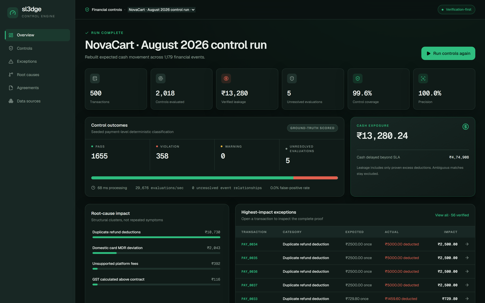
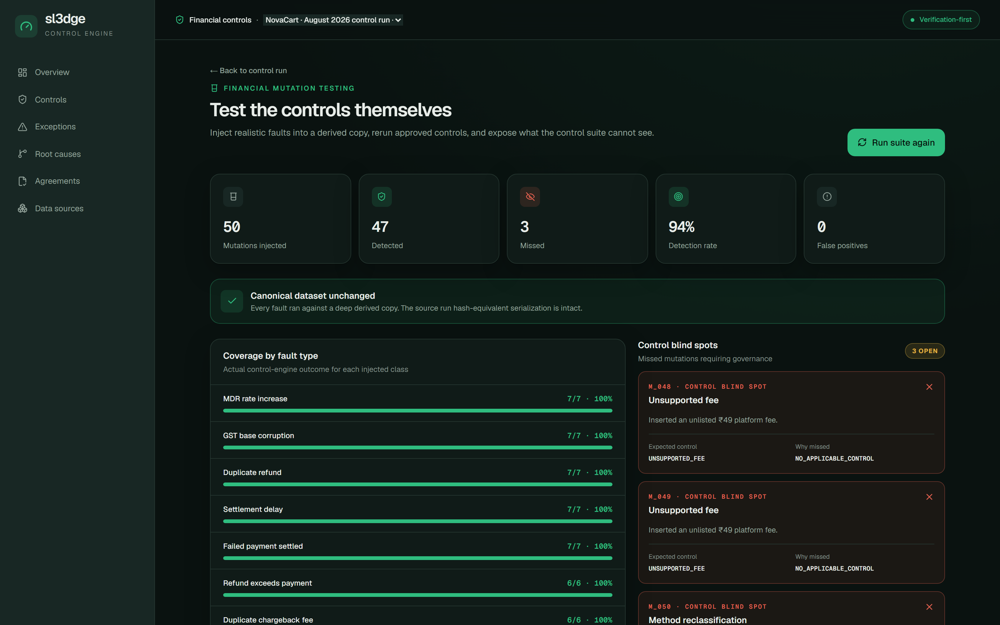

# sl3dge

**A verification-first financial control engine for Razorpay payment lifecycles.**

[](https://github.com/junaidjmomin/buildathon/actions/workflows/ci.yml)

> Reconciliation asks whether records *match*.
> sl3dge asks whether they *should* — and then tests whether the controls
> themselves are capable of catching it when they don't.

sl3dge turns a merchant agreement into **executable controls**, rebuilds the
expected financial outcome of every payment independently of what actually
happened, compares the two, and attributes every rupee of difference to a
verified root cause. Then it goes one step further and **mutation-tests the
control suite itself**: injecting realistic financial faults into known-good
data to prove what the controls can and cannot see.



## How it works

```text
Merchant agreement  ──►  Executable controls (versioned, approved, clause-linked)
Razorpay CSV / API  ──►  Financial event graph (payments, refunds, settlements, bank credits)
                            │
                            ▼
                 Expected vs. actual verification (Decimal-exact)
                            │
                            ▼
        Violations ──► Root-cause clustering ──► Verified leakage (₹)
                            │
                            ▼
        Mutation testing ──► Control blind spots ──► Candidate controls
                                                                (backtest → approve)
```

```text
Next.js ──► FastAPI ──► SQLAlchemy ──► Supabase PostgreSQL
                    │                └─► private Supabase Storage
                    ├─► Razorpay read APIs (worker)
                    └─► LangGraph ──► optional Groq structured output
```

The browser talks to FastAPI only. Supabase service credentials, Razorpay
keys, and the Groq key never leave the backend. AI output is always advisory:
deterministic Python establishes every match, amount, and verdict.

## The demo loop

The seeded NovaCart run (500 payments, 2,018 control evaluations) exercises the
whole product story:

| Step | What you see |
| --- | --- |
| **Run controls** | Every payment re-derived from approved controls; precision and recall scored against hidden ground truth |
| **Exceptions** | Expected vs. actual per transaction, with the exact clause and rate that was breached |
| **Root causes** | Structural clusters (e.g. one duplicated-refund pattern behind 30 symptoms), not repeated symptoms |
| **Proof** | Full financial lineage per transaction: order → payment → settlement → bank credit |
| **Mutation testing** | 50 realistic faults injected into a derived copy — 47 detected, 0 false positives |
| **Blind spots** | The 3 missed mutations are *governance gaps*, surfaced with the expected control that doesn't exist yet |
| **Candidate control** | A draft control from agreement clause 4.6 — backtested against history: 47/50 → 49/50 |



## Verified on a 1,000-payment stress dataset

A labeled production-scale stress pack (`data/stress/`) with planted anomalies
is evaluated by a multi-scope harness — the full report lives at
`backend/test-results/prod_stress_evaluation.json`:

| Metric | Result |
| --- | --- |
| Payment-level detection (P / R / F1) | **1.000 / 1.000 / 1.000** |
| Relationship resolution accuracy | **1.0** (ambiguous bank credits stay unresolved — forcing a match is the failure) |
| Violation lineage accuracy | **1.0** (every finding rooted; downstream mirrors never double-counted) |
| Predicted vs. labeled leakage | ₹15,485.60 vs ₹16,985.60 — the gap is exactly the documented ₹1,500 chargeback-fee blind spot, ₹0.00 unexplained |
| Approved-governed mode coverage | **100%** |
| Invariance | Identical conclusions under ID rename (2,695 identifiers), row shuffle, and dataset relabeling |
| Throughput | ~4,000 control evaluations/sec (deterministic stage) |

## Quick start

### Docker (full stack)

```bash
cp compose.env.example .env   # replace the database password
docker compose up --build
```

Open `http://localhost:3000`. Compose applies Alembic migrations and the
LangGraph checkpoint schema before starting the API and worker. Health probes:
`http://localhost:8000/health/live` and `/health/ready`.

### Local demo (zero external services)

The deterministic pipeline needs neither Razorpay, an LLM, nor Supabase:

```bash
# backend
cd backend
pip install -e ".[dev]"
DATABASE_URL="sqlite:///./local.db" python -m alembic upgrade head
DATABASE_URL="sqlite:///./local.db" python -m uvicorn app.main:app --port 8000 --reload

# frontend (separate terminal)
cd frontend
pnpm install
pnpm dev
```

Open `http://localhost:3000` → **Data sources** → **Open demo run**.

> Executing runs from *uploaded* CSVs (beyond the demo) requires private
> storage: set `SUPABASE_URL` and `SUPABASE_SERVICE_ROLE_KEY` so accepted
> uploads are durably stored and hash-verified at run time.

### Native development

Requirements: Python 3.10+ (3.12 in the container image), Node 24, pnpm 10.33,
PostgreSQL 16 when durable persistence is required.

```bash
python -m venv backend/.venv
backend/.venv/Scripts/python -m pip install -e "./backend[dev]"
pnpm --dir frontend install --frozen-lockfile
```

Copy `.env.example` to `.env` and launch the backend from the repository root
so it reads that file:

```bash
backend/.venv/Scripts/python -m alembic -c backend/alembic.ini upgrade head
backend/.venv/Scripts/python -m app.agents.checkpoint setup
backend/.venv/Scripts/python -m uvicorn app.main:app --app-dir backend --reload --port 8000
```

Next.js reads public configuration from `frontend/.env.local`; copy only the
`NEXT_PUBLIC_*` values — never backend secrets. Then `pnpm --dir frontend dev`,
and run the worker with `backend/.venv/Scripts/python -m app.workers.runner`
when testing Razorpay jobs.

## Seeded acceptance contract

The generator and [manifest](data/demo/manifest.json) are authoritative:

| Record | Exact count |
| --- | ---: |
| Orders / Payments | 500 / 500 |
| Settlements / Bank entries | 84 / 84 |
| Refunds / Chargebacks | 5 / 6 |
| Financial events | 1,179 |
| Event edges | 1,495 |
| Control evaluations | 2,018 |

Stable demo IDs: `PAY_82HD9` (hidden MDR violation), `REF_91` (duplicate
refund), `SET_1042` (SLA violation), `RC_MDR_01` (systemic root cause),
`UNR_003` (unresolved match).

## Verification

```bash
backend/.venv/Scripts/python -m ruff format --check backend/app backend/tests backend/alembic
backend/.venv/Scripts/python -m ruff check backend/app backend/tests backend/alembic
backend/.venv/Scripts/python -m pytest -q backend/tests
pnpm --dir frontend exec tsc --noEmit
pnpm --dir frontend lint
pnpm --dir frontend build
```

CI repeats these against PostgreSQL 16, builds both containers, applies
migrations, and smoke-tests the API from inside the container network.

## Repository layout

```text
backend/
  app/controls/        deterministic control engine + lineage resolution
  app/ingestion/       CSV classification, normalization, bank matching
  app/mutations/       financial mutation-testing engine
  app/persistence/     SQLAlchemy ORM, repositories, Alembic migrations
  app/services/        demo data, governance registry, payment views
  app/integrations/    Razorpay read-only sync
  app/agents/          bounded LangGraph workflows (deterministically verified)
  tests/               151 tests incl. the stress evaluation harness
frontend/
  src/app/             Next.js App Router (overview, exceptions, root causes,
                       coverage, mutation testing, replay, controls, agreements)
data/
  demo/                seeded 500-payment canonical demo (novacart_canonical_demo_v1)
  stress/              1,000-payment labeled stress pack (novacart_prod_stress_v1)
docs/                  handoff documents + API/frontend contracts + screenshots
```

## Production deployment

Use a Supabase transaction pooler URL for `DATABASE_URL`, a direct or session
pooler URL for `MIGRATION_DATABASE_URL`, and keep prepared statements disabled
for pooler compatibility. Build the frontend with its final public API and
OIDC values; `NEXT_PUBLIC_*` settings are compiled into the bundle. Production
startup validates TLS, OIDC, explicit HTTPS CORS, forced HTTPS, Supabase
Storage credentials, and both DSNs — it fails closed. The full release
procedure is in [docs/operations.md](docs/operations.md).

Razorpay live/sandbox behavior cannot be certified until project credentials
are provided; the deterministic pipeline works without Razorpay or an LLM.

## Documentation

- [Product scope and novelty](docs/features.md) — what defines sl3dge
- [Operations and deployment](docs/operations.md)
- [Backend contract](docs/backend.md)
- [Frontend contract and demo flow](docs/frontend.md)
- [Engineering stack](docs/techstack.md)
- [Task register](docs/PENDING_TASKS.md)
- Engagement log ([log.txt](log.txt)) — the full diagnosis and verification
  history behind the stress-evaluation numbers above
