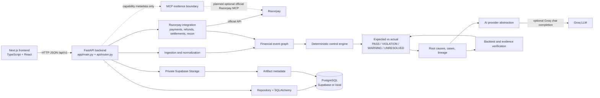

# sl3dge Architecture Index

This document shows how the frontend, backend, database, Razorpay integration, MCP evidence boundary, and AI provider fit together. It distinguishes the current implementation from planned or optional architecture so it is not read as a production-readiness claim.

## System Connection



## Runtime Roles

### Frontend

The Next.js App Router UI is the presentation and interaction layer. The typed client in [frontend/src/lib/api.ts](frontend/src/lib/api.ts) sends requests to the FastAPI prefix `/api/v1` and maps responses into frontend types in [frontend/src/types/api.ts](frontend/src/types/api.ts).

It can request:

- Demo loading and run summaries
- Violations, root causes, cases, lineage, and payment graphs
- Agreement and control proposals
- Hypothesis generation and verification
- Razorpay connection and synchronization
- MCP capability status
- CSV source uploads

The browser does not query PostgreSQL or Supabase finance tables directly. FastAPI remains the application API and finance trust boundary.

### Backend

FastAPI is created in [backend/app/main.py](backend/app/main.py) and registers the API router from [backend/app/api/router.py](backend/app/api/router.py). Route handlers coordinate services; the financial decisions are made deeper in the application:

1. Source files or Razorpay records enter ingestion and mapping.
2. Canonical financial events and their relationships form a lifecycle graph.
3. The deterministic control engine calculates expected values and compares them with actual values.
4. Results become pass, violation, warning, or unresolved outcomes.
5. Root-cause and exception services organize verified findings.
6. Optional AI actions generate bounded hypotheses or explanations.
7. Verification and backtesting classify those hypotheses independently.

The core financial pipeline is designed to work without an LLM. In the current
demo implementation, several AI-looking results are deterministic seeded
responses rather than live model output; see [AI Boundary](#ai-boundary).

### Database and storage

The intended persistence path is:

```text
FastAPI -> SQLAlchemy repository -> PostgreSQL
                                      ^
                                      |
                         Supabase Postgres in deployment
```

The database implementation is in [backend/app/persistence/database.py](backend/app/persistence/database.py). `DATABASE_URL` selects PostgreSQL; when it is absent, development/demo services can use in-memory state. Alembic manages schema changes.

Current implementation status: PostgreSQL is used for selected writes, including
some demo loading, audit records, artifact metadata, and Razorpay sync data. Most
API reads for the seeded demo, including summaries, violations, root causes,
payment views, and cases, still come from the process-global `DemoStore` rather
than repository-backed queries. The database diagram therefore describes the
target durable architecture, not a complete database-backed read path.

Supabase Storage is separate from Postgres:

```text
Uploaded agreement/source/evidence bytes -> private Supabase Storage bucket
Artifact ID, bucket, path, checksum, type, size, provenance -> PostgreSQL
```

The upload flow is implemented by [backend/app/storage/service.py](backend/app/storage/service.py) and the source route in [backend/app/api/router.py](backend/app/api/router.py). The browser receives metadata or an object path, not privileged storage credentials.

## Razorpay and MCP

Razorpay synchronization uses the official API client and mapping modules in [backend/app/integrations/razorpay](backend/app/integrations/razorpay). The sync fetches payments, refunds, settlements, and reconciliation data, maps them into canonical events and edges, and persists them when PostgreSQL is configured.

MCP is an optional supplementary evidence boundary, represented by [backend/app/integrations/razorpay/mcp_evidence.py](backend/app/integrations/razorpay/mcp_evidence.py):

- It currently reports static capability metadata through `/api/v1/integrations/razorpay/mcp-evidence-capability`.
- The capability flag is enabled only when `RAZORPAY_MCP_ENABLED=true`.
- There is currently no MCP client call, remote evidence lookup, or MCP evidence persistence in this repository.
- A future implementation may add bounded read-only lookups against the official Razorpay MCP endpoint.
- It is not authoritative and cannot change controls, calculations, case status, or hypothesis verdicts.
- Direct Razorpay API ingestion remains the input of record.

## AI Boundary

The provider abstraction is in [backend/app/ai/provider.py](backend/app/ai/provider.py). The configured default is Groq with the model from `LLM_MODEL`; the API key is supplied through `GROQ_API_KEY`. The backend exposes AI capability status and has a live Groq client abstraction, but current demo routes do not invoke `provider_client.generate()` for their business results. Seeded hypothesis and proposal responses are deterministic service data.

AI may assist with:

- Agreement clause to candidate-control proposals
- Schema-mapping suggestions
- Root-cause hypotheses
- Human-readable evidence summaries
- Explanations of already-computed results

AI may not decide:

- Arithmetic truth
- Control pass/fail status
- Leakage or financial impact
- Precision/recall
- Ambiguous record matching
- Automatic approval of a financial control

The deterministic control and verification layers remain authoritative even when AI is configured. Without provider configuration, AI-only endpoints degrade explicitly while the core pipeline remains available.

## Current Integration Status

| Area | Current behavior | Boundary or limitation |
| --- | --- | --- |
| Frontend to backend | Typed Next.js client calls FastAPI `/api/v1` routes | API reads are primarily demo-store backed |
| Database | SQLAlchemy and Alembic support PostgreSQL/Supabase | Selected writes are persisted; most demo reads remain in memory |
| Razorpay | Fetches and maps payments, refunds, settlements, and reconciliation data | Sync currently stops at canonical events and edges; it does not run controls or create evaluations |
| Supabase Storage | Backend-only adapter can upload source artifacts | Requires configuration; bucket privacy and policies are external deployment responsibilities |
| MCP | Capability metadata endpoint | No remote MCP invocation or evidence retrieval is implemented |
| AI | Provider abstraction and capability reporting | Current demo business responses are seeded/deterministic; live provider calls are not wired into those actions |
| LangGraph | Not installed or imported | Optional future orchestration choice only |

## Detailed Sweep Notes

These are important follow-up risks before describing the system as production-ready:

- Tenant isolation needs a full review. OIDC principals exist, but many demo endpoints read global `DemoStore` state without filtering by `principal.tenant_id`.
- The tenant RLS migration should cover every tenant-owned table. The current migration does not cover all models that contain `tenant_id`, including source snapshots, control evaluations, and background jobs.
- Razorpay synchronization currently provides canonical ingestion only. A separate control-run step is needed before live Razorpay data can produce deterministic evaluations and violations.
- Supabase Storage is accessed with backend credentials, but bucket privacy and storage policies are deployment configuration rather than enforced by the application migrations.
- The backend test suite covers seeded demo behavior and adapters, but should be supplemented with tenant-isolation, complete-RLS, real-sync persistence, MCP, provider transport, and API contract tests.
- The frontend has a documented build risk: `frontend/src/lib/format.ts` uses BigInt syntax while `frontend/tsconfig.json` targets ES2017. Verify the frontend production build before relying on the UI status.

## Is LangGraph Used?

**No, not currently.**

The repository does not declare or import LangGraph. The current design uses ordinary FastAPI routes and service modules, with a direct provider abstraction for bounded AI calls. LangGraph is mentioned in the design documents only as an optional future choice if explicit orchestration nodes become genuinely useful. It should not be described as part of the current runtime architecture.

## Trust Boundary Summary

```text
Frontend
  -> FastAPI API
      -> deterministic domain and control logic  [authoritative]
      -> repository / PostgreSQL                  [durable records]
      -> private Supabase Storage                 [file bytes]
      -> Razorpay API                             [source integration]
      -> optional MCP evidence                    [supplementary only]
      -> optional AI provider                     [proposal / explanation only]
```

The central rule is: AI and MCP can add context, but only deterministic sl3dge verification can establish financial truth. The current repository implements the demo control path most completely; database-backed reads, live AI actions, MCP evidence retrieval, and Razorpay-to-control execution remain incomplete or optional.
